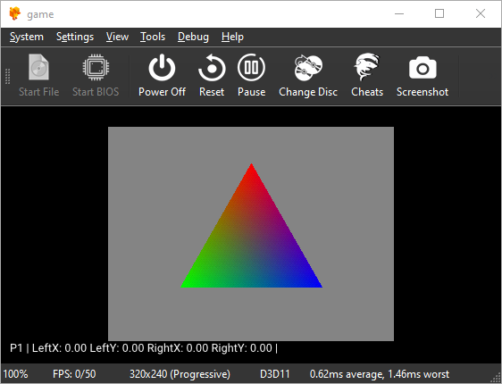
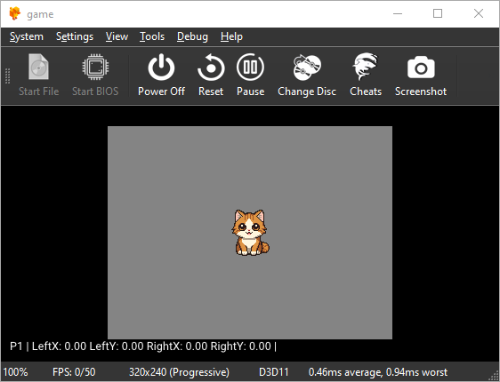
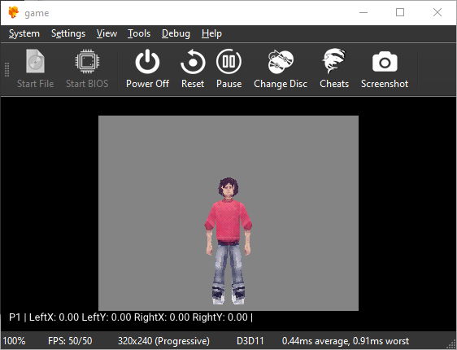
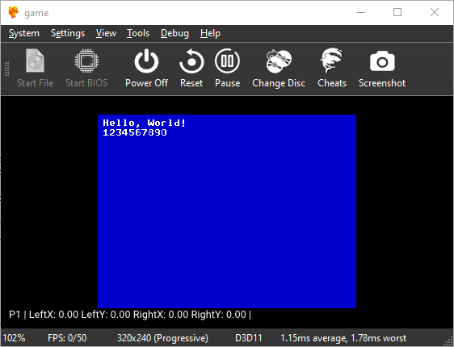

# Retrolang SDK

The goal of this project is to build a PlayStation 1 development toolchain completely from scratch, without relying on GCC, LLVM, or other similar compiler frameworks. It features a low-level C-like language, Retrolang, that compiles to MIPS R3000 machine code.

Retrolang currently allows you to write simple programs: output data to the TTY, access the gamepad, and draw simple 2D and 3D graphics (directly or via DMA).

All provided software is experimental and is in alpha stage.






## Rationale

Retrolang is a result of 10+ years of tinkering with PsyQ SDK, custom GPU libraries and related tools. It was initially created as an assembler (alternative to ASMPSX), but eventually got many improvements.

Main philosophy of the project: PSX programming doesn't require a full-fledged C. A subset is sufficient. What we really need are platform-specific language capabilities and a simple, readable and easily hackable standard library. Popular C toolchains also tend to be bulky; Retrolang produces tiny executables that can run via [FreePSXBoot](https://github.com/brad-lin/FreePSXBoot).

## RLC

The main tool is RLC, the Retrolang Compiler. It combines an assembler, compiler, and a linker in a single program and directly outputs `PSX.EXE`.

Usage:

```
rlc -o PSX.EXE src/main.r
```

Because there are no object files and incremental building support at the moment, main source file (`main.r`) should contain the whole program. You can use C-like `#include`s to make a single source file from multiple files. It is recommended to use `.ri` extension for included files.

Assembling command is similar (RLC treats *.s file as an assembly source):

```
rlc -o PSX.EXE src/main.s
```

RLC translates your program verbatim, without optimizations and unexpected changes behind your back. You are solely responsible for writing good-quality code and using the console's limited resources wisely.

## PSXDISASM

Work-in-progress dumper and disassembler for PsyQ LNK *.obj files and PSX-EXE files. Based on [LNK disassembler](https://github.com/gecko0307/psxlib/tree/main/tools/psxdisasm) from PSXLib.

## Retrobuild

Build automation system. Compiles a Retrolang project into a PlayStation 1 executable, packs it into a CD-ROM image (CUE+BIN), and generates a CU2 sector index for [PSIO](https://psio.cybdyn-systems.com.au/). Uses TOML manifest files (`retrobuild.toml`) to describe a project.

## The Language

Retrolang is a very basic curly-bracket procedural language inspired by C, but designed to run in extremely memory-constrained environments.

**Primitive types**: `int`, `short`, `char`, `uint`, `ushort`, `uchar`, `void`, and pointers to them. Pointers compare as unsigned. Literals above `0x7FFFFFFF`, or with a 'u' suffix, are unsigned. Like C, `uchar`/`ushort` promote to (signed) `int` in arithmetic; only `uint` makes `/`, `%`, `>>` and comparisons unsigned. C-style type casts are supported.

**Arrays**: C-like static arrays and strings:

```c
int t[4] = {1, 2, 3, 4};
char hello[] = "Hello!";
```

Constant initialization is supported only for global arrays.

**Structs**: top-level definitions `struct Name { int a; uchar c[3]; };`. Used as `struct Name x;`. Fields may be scalars, pointers, arrays or nested structs. Structs can be copied with `=` (inline, up to 32 words), have their address taken, and be measured with `sizeof(struct Name)`. Not supported: struct initializers, passing/returning structs by value, unions, bit-fields, `typedef`, `sizeof(expression)`.

**Operators**: all basic arithmetic, logical and bitwise operators are supported. Retrolang uses C precedence. Ternary operator is not supported.

**Statements**: `if`/`else`, `while`, `do`-`while`, `for`, `break`, `continue`, `return`.

**Function calls**: follows O32 ABI. Supports up to 4 arguments (passed in `$a0`-`$a3`), result in `$v0`.

**Program entry point**: `main()`, started from a small stub that sets `$sp`.

**Intrinsics**: BIOS calls `bios_a(n, ...)`, `bios_b(n, ...)`, `bios_c(n, ...)` through the `A0h`/`B0h`/`C0h` vectors with up to 3 further arguments. `n` is a function number which is passed in `$t1` register.

**Embedded files**: a global array can have an attribute `@("file.bin")` to embed a file to the executable.

**External assembly**: a function with an attribute `@("file.s")` relies on external implementation in Retrolang assembly. The compiler still generates prologue/epilogue for such functions. Local data/jump labels can be used inside the assembly source. Globally visible assembly labels are not supported.

**Code generation notes:**

- Local variables live in `$s0`-`$s7` (callee-saved) unless their address is taken, in which case (or when registers run out) they live in the stack frame.
- Expression temporaries use `$t0`-`$t9` as a register stack. Live temporaries are saved around calls.

**Example program:**

```c
void main()
{
    bios_a(0x3F, "Hello, World!\n");
}
```

The same in Retrolang assembly:

```asm
.text
    li $a0, .msg
    li $t1, 0x003f
    li $t2, 0x00a0
    jr $t2
    nop
    
    jr $ra
    nop

.data
  .msg:
    "Hello, World!\n\0"
```

## Standard Library

Retrolang provides a minimal set of low-level functionality that aid with writing PlayStation programs. It is partly a port of [PSXLib project](https://github.com/gecko0307/psxlib). These files are meant to be directly included to the main source file using `#include` directive.

* `core.ri` - core definitions
* `gpu.ri` - GPU driver / graphics API
* `pad.ri` - gamepad driver.

Usage (assuming you've copied the [include](/examples/include) folder to your project's source directory):

```c
#include "include/core.ri"
#include "include/pad.ri"
#include "include/gpu.ri"
```

## Examples Collecions

`examples` directory contains a number of basic demos showcasing possibilities of RLC.

- [asm](/examples/asm) - "Hello, World" program implemented in assembly
- [external_asm](/examples/external_asm) - external assembly function example (printing an argument to TTY and returning a value)
- [pad](/examples/pad) - gamepad test, logs pressed buttons to TTY
- [triangle](/examples/triangle) - classic colored triangle demo (direct rendering via GP0)
- [dma](/examples/dma) - classic colored triangle demo (queued rendering via command buffer)
- [sprite](/examples/sprite) - TIM texture loading and sprite rendering (direct rendering via GP0)
- [text](/examples/text) - bitmap font loading and text rendering (queued rendering via command buffer)
- [mesh](/examples/mesh) - walkable 3D scene with a first person camera.

To build an example, run `build.bat` under Windows, or `build.sh` under Linux.

RLC must be available system-wide or locally as `/rlc/rlc.exe` in the repository.

Optionally, to build a CD-ROM image, mkpsxiso must be available system-wide or locally as `/mkpsxiso/mkpsxiso.exe` in the repository.

Optionally, to gererate a *.cu2 file (for PSIO), Python must be installed.

## Recommended Tools

Provided examples rely the following third-party tools:

- [mkpsxiso by Lameguy64](https://github.com/lameguy64/mkpsxiso) to build CD-ROM images
- [img2tim by Lameguy64](https://github.com/lameguy64/img2tim) to convert textures to TIM format
- [Blender](https://blender.org) to export meshes to PSM format.

For running examples on the PC, we recommend [DuckStation](https://www.duckstation.org/), a fast and feature-rich PlayStation emulator for Windows, Linux and Mac. To run an image (or directly `PSX.EXE` if you don't build an image), use the following command:

```
duckstation -fastboot -- %~dp0/game.bin
```

or

```
duckstation -fastboot -- %~dp0/iso/PSX.EXE
```

## TODO

What is not implemented yet in the language:

- Stack arguments
- Modules

In the library:

- GTE
- Matrix math
- CD-ROM I/O
- Heap allocator
- Sound
- Memory cards
- Analog sticks

## License

RLC, PSXDISASM, Retrobuild are distributed under the Boost Software License, 1.0.

The standard library and all examples are distributed under Unlicense/Public Domain.
